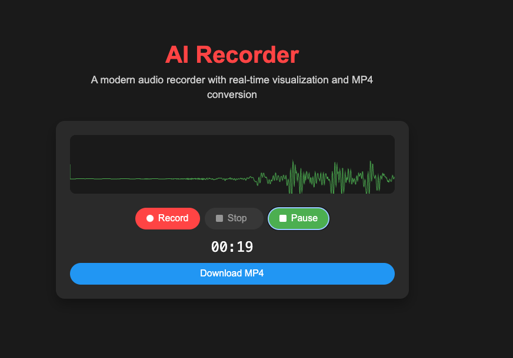

# AI Recorder

A modern web-based audio recorder with real-time visualization and MP4 conversion capabilities. Built with vanilla JavaScript and Express.js.

## Features

- 🎙️ Browser-based audio recording
- 📊 Real-time audio visualization
- 🎨 Dark/Light theme support
- 🔄 MP4 format conversion
- 📱 Responsive design
- 🎵 Audio playback with visualization
- ⬇️ Download recordings as MP4

## Tech Stack

- Frontend: Vanilla JavaScript, HTML5, CSS3
- Backend: Node.js, Express.js
- Audio Processing: Web Audio API
- Conversion: FFmpeg.wasm
- Performance Optimizations: Hardware acceleration, Canvas optimization

## Prerequisites

- Node.js (v14 or higher)
- npm (Node Package Manager)
- Modern web browser with microphone support

## Installation

1. Clone the repository: 